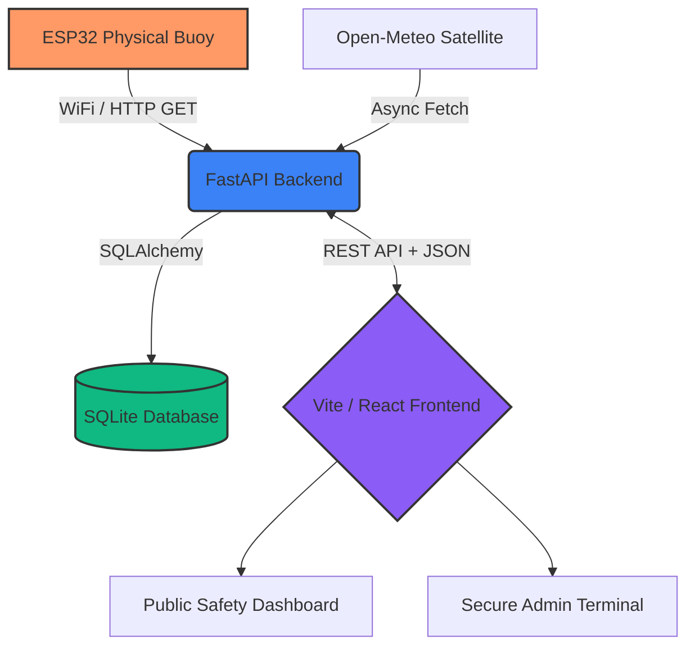

<div align="center">
  
  
  
</div>
<br>

<h1 align="center">🌊 WaveGuard v4</h1>
<h4 align="center">Smart Near-Shore Swell Surge (Kallakkadal) Early-Warning System</h4>

<p align="center">
  <strong>Mission Control for the Coast.</strong><br>
  A high-performance, real-time wave monitoring system designed for the Kanayannur coastal zone, Kerala. WaveGuard detects dangerous sea conditions using a cutting-edge fusion of physical buoy telemetry (ESP32) and Open-Meteo satellite data.
</p>

---

## ✨ System Highlights

- 🚁 **Mission-Control Aesthetics**: Premium dark-mode React UI with glassmorphism and real-time telemetry gauges.
- 📡 **Live Hardware Integration**: Sub-second polling updates directly from custom-built ESP32 marine buoys.
- 📐 **Data Fusion Engine**: Intelligently combines MPU-6050 accelerometer data (g-force) with satellite significant wave height (Hs) to prevent false alarms.
- 🚨 **Bilingual Alerts**: Interactive public portals supporting English and Malayalam for local coastal communities.
- 🔐 **Secure Admin Terminal**: Role-based JWT access for infrastructure management and live status monitoring.

---

## 🛠️ Project Architecture



## 📂 Directory Structure

```text
waveguardv4/
├── backend/              # FastAPI Python server (Primary Logic & API)
│   ├── main.py           # Core hardware endpoints & data fusion
│   ├── models.py         # SQLAlchemy DB schemas
│   ├── database.py       # Database engine & SQLite session
│   ├── .env              # Environment secrets
│   └── requirements.txt  # Python dependencies
├── frontend-react/       # React + Vite Frontend
│   ├── src/pages/        # Public Portal & Admin Dashboard
│   ├── src/components/   # Modular UI components (Gauges, Charts)
│   ├── public/assets/    # Images & styling assets
│   └── vite.config.js    # Vite bundler & API proxy logic
└── how_to_run.md         # Exhaustive developer manual
```

---

## 🚀 Quick Start Guide

> For complete, exhaustive details (including hardware flashing), see the official [`how_to_run.md`](./how_to_run.md) file.

### 1. Environment & Database Setup
```powershell
# Navigate to backend and initialize the virtual environment
cd backend
python -m venv venv

# Activate (Windows)
.\venv\Scripts\Activate.ps1

# Install required packages
pip install -r requirements.txt
```

Ensure `backend/.env` contains your admin credentials:
```ini
WAVEGUARD_ADMIN_USER=admin
WAVEGUARD_ADMIN_PASS=waveguard2024
```

### 2. Launch the Brain (FastAPI Backend)
There are two ways to run the backend depending on whether you are using the physical ESP32 buoy or just testing the UI simulation locally.

**Option A: Local Simulation Only (No Hardware Required) 💻**
If you are presenting the interface or testing via API simulation, run this inside your active virtual environment:
```powershell
python -m uvicorn main:app --reload --port 8005
```

**Option B: Physical ESP32 Hardware Mode 🚨**
If you are actively connecting the ESP32 buoy over Wi-Fi, you **must bind the host to 0.0.0.0** so the backend can accept connections from other devices on your local network:
```powershell
python -m uvicorn main:app --reload --host 0.0.0.0 --port 8005
```

- **Live API Endpoint**: `http://localhost:8005`
- **Swagger Documentation**: `http://localhost:8005/docs`

### 3. Launch the Mission Control (React Frontend)
Open a *second* terminal window:
```powershell
cd frontend-react
npm install
npm run dev
```
- 📱 **Public Portal**: `http://localhost:3000`
- 🖥️ **Admin Console**: `http://localhost:3000/admin`

---

## 📡 Hardware Integration (ESP32)

WaveGuard is designed for physical marine deployment. Ensure your ESP32 is flashing data to the correct local IPv4 address of your laptop.

**ESP32 C++ Payload Example:**
```cpp
// Replace 10.38.178.14 with the laptop's Wi-Fi IPv4 address
String url = "http://10.38.178.14:8005/api/buoy?motion=" + String(avg_motion) + "&speed=" + String(calculated_speed) + "&status=" + status_string;
http.GET();
```

---

## ⚙️ Algorithmic Alert Intelligence

WaveGuard utilizes a multi-factor classification matrix to prevent false positives (e.g., a boat hitting the buoy) while ensuring genuine Kallakkadal swell surges trigger immediate evacuation alerts.

| Alert Level | Buoy Accelerometer (g) | Satellite Wave Height | Fusion Action Taken |
| :--- | :--- | :--- | :--- |
| 🟢 **NORMAL** | `< 0.05 g` | `< 1.5 m` | Green Light (Safe) |
| 🟡 **WATCH** | `0.05 - 0.09 g` | `1.5 - 2.4 m` | Amber Alert (Caution) |
| 🔴 **WARNING** | `≥ 0.10 g` | `≥ 2.5 m` | Immediate Evacuation |

---

## 🧪 Built-In Simulation

No hardware? No problem. Trigger specific sea states via the CLI to test the dashboard response:

```bash
# Simulate a CALM sea state
curl -X POST "http://localhost:8005/api/test-buoy?motion=0.02&device_status=CALM"

# Simulate a DANGEROUS HIGH WAVE
curl -X POST "http://localhost:8005/api/test-buoy?motion=0.25&device_status=HIGH%20WAVE"
```

---

<p align="center">
  <em>Developed for coastal safety and academic resilience research. Powered by Deeply Integrated Data & Modern Web Standards.</em>
</p>
